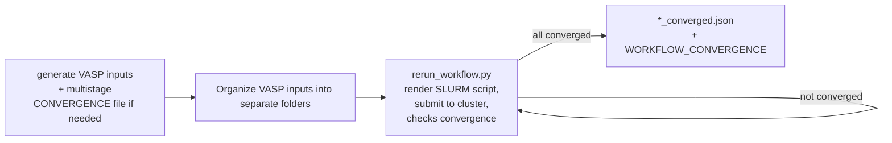

# vasp_workflow

High-throughput tool for [VASP](https://www.vasp.at/) density-functional-theory
calculations on SLURM HPC clusters.

> **Background:** This workflow was originally developed by my PhD mentor
> [Ryan Morelock](https://github.com/rymo1354) for the Musgrave research group
> at CU Boulder, targeting NREL's Eagle cluster
> (see the [upstream repository](https://github.com/rymo1354/vasp_workflow)).
> I'm an active contributor and user of this shared lab tool; this fork contains my
> extensions for running the workflow on additional HPC systems and for 
> noncollinear/spin-orbit-coupling calculations. Day to day, I generate 
> VASP input files separately and rely on this repo primarily for job submission and 
> management via rerun_workflow.py

## My contributions

- Added **Kestrel** cluster support (queue routing and submission logic) in `vasp_run/vasp.py`
- Added **Alpine** cluster support (CU Boulder's HPC) in the SLURM job-script template
- Wired up **noncollinear / spin-orbit-coupling (SOC)** capability - added and fixed
  `VASP_NCL` environment variable that flows from job submission through template
  rendering to VASP binary selection (previously a path hardcoded to a colleague's
  home directory), plus a guard that errors out on invalid SOC + forced-gamma-point
  configurations instead of silently submitting a broken run
- Fixed sub-hour walltime handling in the job-time templating (previously truncated
  fractional `AUTO_TIME` values down to whole hours)
- Generalized the SLURM `--account` flag to more HPC clusters (previously Eagle-only) and
  fixed related node-count templating for Summit/Alpine

## How it works

1. **Generate VASP input files** - can be done with built in `create_input_yaml.py` and `generate_vasp_inputs.py` or externally. For my use case, I typically generate my inputs using a separate notebook.
2. **Organize VASP inputs into separate folders** e.g. for 2 calculations:
   halide_perov_PBE
   - CsPbBr3
      - POSCAR
      - POTCAR
      - KPOINTS
      - INCAR
      - CONVERGENCE (needed for automating multi-stage runs)
   - CsSnI3
      - POSCAR
      - POTCAR
      - KPOINTS
      - INCAR
      - CONVERGENCE (needed for automating multi-stage runs)
3. **`rerun_workflow.py` in calculation folder (e.g. in halide_perov_PBE directory)** - Walks the input folder tree, checks if jobs are multi or single step (`CONVERGENCE`), checks SLURM queue state, parses `vasprun.xml` for electronic/ionic convergence, and manages multi-stage runs, resubmits stalled single points with more electronic steps.

## Tech stack

Python · [pymatgen](https://pymatgen.org/) (VASP I/O, Materials Project API) ·
[custodian](https://materialsproject.github.io/custodian/) (VASP error handling and
recovery) · Jinja2 (SLURM templating) · YAML · SLURM

## Setup

1. Clone the repo and put the repo root and `workflow_scripts/` on your `$PATH` and
   `$PYTHONPATH`.
2. Install dependencies: `pymatgen`, `pyyaml`, `custodian`, `jinja2`.
3. Obtain `cfg.py`, `Classes_Custodian.py`, `Classes_Pymatgen.py`, `Helpers.py` dependencies. These are scripts written by
   the Musgrave group members that help pilot this workflow.
4. Set the cluster-specific environment variables `vasp.py` (called by `rerun_workflow.py`) depends on:
   - `VASP_MPI`: identifies which run command to use "mpirun", "srun", etc.
   - `VASP_KPTS`: path to vasp_std
   - `VASP_GAMMA`: path to vasp_gam
   - `VASP_NCL`: path to vasp_ncl
   - `VASP_TEMPLATE_DIR`: path to jinja2 template directory (needed to write proper slurm submission for VASP simulations)
   - `VASP_DEFAULT_TIME`: default calculation runtime (optional)
   - `VASP_DEFAULT_ALLOCATION`: default allocation for HPC (optional)
5. Materials Project API key: set the MP_api_key variable in configuration/mp_api.py to your own key 
   (get a free one [here](https://materialsproject.org/open)). Only useful if generating VASP inputs using this workflow instead of externally

## Acknowledgments and full workflow instructions:

Originally developed by [Ryan Morelock](https://github.com/rymo1354). See the
[upstream repository](https://github.com/rymo1354/vasp_workflow) for the original
project and its full field-by-field configuration documentation.
