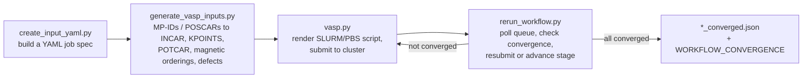

# vasp_workflow

High-throughput orchestration for [VASP](https://www.vasp.at/) density-functional-theory
calculations on SLURM/PBS HPC clusters. Turns a single YAML config — a set of structures
plus calculation parameters — into hundreds of correctly-configured VASP input decks,
submits them to a queue, and automatically monitors, reruns, and advances unconverged
jobs until the whole batch is done.

> **Background:** This workflow was originally developed by my PhD mentor
> [Ryan Morelock](https://github.com/rymo1354) for the Musgrave research group
> at CU Boulder, targeting NREL's Eagle cluster
> (see the [upstream repository](https://github.com/rymo1354/vasp_workflow)).
> I'm an active contributor and user of this shared lab tool; this fork contains my
> extensions for running the workflow on additional HPC systems and for 
> noncollinear/spin-orbit-coupling calculations. Day to day, I generate 
> VASP input files separately and rely on this repo primarily for job submission and 
> management via rerun_workflow.py

## My contributions

- Added **Kestrel** cluster support (queue routing and submission logic) in `vasp_run/vasp.py`
- Added **Alpine** cluster support (CU Boulder's HPC) in the SLURM job-script template
- Wired up **noncollinear / spin-orbit-coupling (SOC) runs end-to-end** — added a
  `VASP_NCL` environment variable that flows from job submission through template
  rendering to VASP binary selection (previously a path hardcoded to a colleague's
  home directory), plus a guard that errors out on invalid SOC + forced-gamma-point
  configurations instead of silently submitting a broken run
- Fixed sub-hour walltime handling in the job-time templating (previously truncated
  fractional `AUTO_TIME` values down to whole hours)
- Generalized the SLURM `--account` flag to more HPC clusters (previously Eagle-only) and
  fixed related node-count templating for Summit/Alpine


## How it works



1. **`create_input_yaml.py`** — interactive CLI that builds a YAML config: which
   structures to run (Materials Project IDs and/or local POSCAR paths), calculation
   type (bulk or point defect), magnetic-ordering scheme (preserve / FM / AFM /
   FM+AFM enumeration), relaxation set, and per-stage INCAR/KPOINTS settings for
   multi-step convergence.
2. **`generate_vasp_inputs.py`** — reads that YAML, pulls structures from the
   Materials Project or disk, applies magnetic-ordering enumeration and supercell
   rescaling, and writes a full directory tree of VASP input decks (`INCAR`,
   `KPOINTS`, `POTCAR`, `POSCAR`, `CONVERGENCE`) via `pymatgen`.
3. **`vasp.py`** — detects job type and target cluster, resolves walltime/nodes/cores/
   queue from `INCAR` tags or environment defaults, renders a Jinja2 SLURM/PBS batch
   script wrapping `custodian`'s error-handling VASP runner, and submits it.
4. **`rerun_workflow.py`** — the operational core, typically run on a cron. Walks the
   job tree, checks SLURM queue state, parses `vasprun.xml` for electronic/ionic
   convergence, and either advances a multi-stage `CONVERGENCE` run, resubmits with
   relaxed settings (e.g. more electronic steps), or marks the job complete — until
   every job in the batch has converged.

## Tech stack

Python · [pymatgen](https://pymatgen.org/) (VASP I/O, Materials Project API) ·
[custodian](https://materialsproject.github.io/custodian/) (VASP error handling and
recovery) · Jinja2 (SLURM/PBS templating) · YAML · SLURM / PBS

## Setup

1. Clone the repo and put the repo root and `workflow_scripts/` on your `$PATH` and
   `$PYTHONPATH`.
2. Install dependencies: `pymatgen`, `pyyaml`, `custodian`, `jinja2`.
3. Materials Project API key: set the MP_api_key variable in configuration/mp_api.py to your own key 
   (get a free one [here](https://materialsproject.org/open)).
4. Set the cluster-specific environment variables `vasp.py` depends on: `VASP_KPTS`,
   `VASP_GAMMA`, `VASP_NCL`, `VASP_MPI`, `VASP_TEMPLATE_DIR`, and optionally
   `VASP_DEFAULT_TIME`, `VASP_DEFAULT_ALLOCATION`, `VASP_DEFAULT_QUEUE`.

## Usage

The full pipeline below is the intended end-to-end flow; in practice I generate inputs separately and use rerun_workflow.py as the operational core for submission, monitoring, and resubmission.

```bash
# 1. Build a config from a template, editing structures and calc type interactively
create_input_yaml.py -o my_run.yml -c templates/bare_relax_template.yml -e MPIDs Calculation_Type

# 2. Generate the VASP input directory tree for every structure / magnetic-ordering combination
generate_vasp_inputs.py -r my_run.yml

# 3. From within the generated bulk/ or defect/ directory, submit and monitor
rerun_workflow.py
```

Run `rerun_workflow.py` again (e.g. on a cron) to poll job status, auto-resubmit
unconverged or fizzled jobs, and advance multi-stage convergence runs. Once every job
in the tree has converged, it writes a `WORKFLOW_CONVERGENCE` marker file and a
`<workflow_name>_converged.json` summary of all results.

## Configuration reference

The YAML config (see `templates/*.yml` for examples) fully specifies a batch run.
Fields, as validated by `create_input_yaml.py`:

| Field | Purpose |
|---|---|
| `MPIDs` | Materials Project IDs to pull structures from (e.g. `mp-5223`); validated against the MP API before being added. |
| `PATHs` | Local POSCAR/CONTCAR file paths to use as structures instead of/alongside MPIDs. |
| `Calculation_Type` | `bulk` or `defect`. `Rescale` toggles automatic supercell rescaling; `defect` additionally takes an element symbol to remove one atom of (per symmetry-unique site). |
| `Relaxation_Set` | Which pymatgen Materials Project input set to use as the INCAR/KPOINTS baseline (`MPRelaxSet`, `MPScanRelaxSet`, etc.). |
| `Magnetization_Scheme` | `preserve`, `FM`, `AFM`, or `FM+AFM` — enumerates ferromagnetic and/or randomized antiferromagnetic orderings (with a max-count cap for AFM) for each structure. |
| `INCAR_Tags` | Per-stage INCAR overrides for multi-step convergence (`0 Step` through `10 Step`). User tags override the relaxation set's defaults — take care with `LDAUU`/`LDAUJ`/`LDAUL`, which get fully overwritten rather than merged. |
| `KPOINTs` | Per-stage KPOINTS generation scheme. `0 Step` supports all generation types; later stages are restricted to gamma-centered schemes, a constraint of the multi-step convergence runner. |
| `Max_Submissions` | Accepted but not yet enforced. |

`generate_vasp_inputs.py -r <file.yml>` consumes that config and writes a full `bulk/`
or `defect/` directory tree of VASP input decks. Run it from the parent directory where
you want the tree created; `POTCAR` generation requires pseudopotentials on `$PATH`.

`rerun_workflow.py` is then run from that same parent directory to submit and, on
subsequent runs, monitor/rerun jobs. If a job fails inside VASP due to bad input
parameters or a bad VASP build, `custodian`'s error messages can be misleading — a
plain bash submission script is often faster for tracking down the real error.

## Known limitations

- `rerun_workflow.py` does not yet handle NEB (nudged elastic band) calculations
- `Max_Submissions` in the YAML config is accepted but not yet enforced
- A few environment expectations (conda environment location, VTST-Tools path) still
  assume the original lab's shared HPC setup rather than a general-purpose install

## Acknowledgments

Originally developed by [Ryan Morelock](https://github.com/rymo1354). See the
[upstream repository](https://github.com/rymo1354/vasp_workflow) for the original
project and its full field-by-field configuration documentation.
